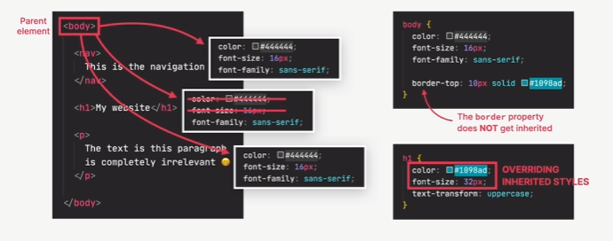

# HTML and CSS Notes

## HTML

### Document Structure

- **Doctype and Root Elements**: Every HTML document must begin with `<!DOCTYPE html>` to define the document type and ensure that browsers process it in standards compatibility mode. Next, use the `<html>` tag that encompasses all the content of the page, including `<head>` and `<body>`.
- **Head**: Contains metadata and links to external style sheets or scripts that are not directly displayed on the page.
- **Body**: Includes all visible content such as texts, images, links, etc.

### Text Elements

- **Headings (`<h1>` to `<h6>`)**: Serve to define the hierarchy and structure of the content. The size and importance decrease from `<h1>` to `<h6>`.
- **Paragraphs (`<p>`)**: Defines text blocks.
- **Text Emphasis**:
  - `<strong>` to emphasize text (semantic substitute for `<b>`).
  - `<em>` to emphasize text, usually shown in italic (semantic substitute for `<i>`).

### Lists

- **Ordered Lists (`<ol>`)**: For lists that follow a numerical order.
- **Unordered Lists (`<ul>`)**: For lists without a specific order.
- **List Items (`<li>`)**: Each item within the lists.

### Images and Multimedia

- **Images (``)**: Includes an image in the document. `alt` is crucial for accessibility and SEO.

### Links

- **Links (`<a href="url">text</a>`)**: To link to other pages. Use `target="_blank"` to open the link in a new tab.

## CSS

### Selecting and Styling Elements

- **CSS Rules**: Formed by selectors and declaration blocks, where each declaration consists of a property and a value.

### Methods to Include CSS:

- **Inline**: Directly in the HTML element using the `style` attribute.
- **Internal**: Inside `<style>` in the `<head>` of the page.
- **External**: Through a `.css` file linked with `<link>`.

### Advanced Concepts

- **Pseudo-Classes**: To define styles in specific states of the elements (such as `:hover`, `:active`).

These suggestions should help you have clearer and more useful notes. Is there anything specific within these sections that you would like to delve deeper into or any other topic in your notes that you need to organize?

### Conflict Between Selectors

#### Priorities

Example:
There are three diferente selectors referencing to the same element (p, id, class), and the one that will be applied is that all of them apply, however there a different font-sizes declarations. CSS applies a rule of priority when there are multiple declarations according of how they appear, meaning that ID is one that will apply, nevertheless, if there is many ID selectors, then the last selector in code applies. The secnond in priority is the class(.) or pseudo-class (:) selector, and then element (p, div, li, etc) selector, and finally the universal selector (\*), thus being of the lower priority. Above all this, the inline styles (ones declared in the HTML file) will be the one with the highest priority, but it should not be done because it is not a good practice to use inline-styles, there are also the declarations marked `!Important` which is like a hack that is only used as a last resort to resolve conlficts in the CSS.

HTML

```HTML
<p id="author-text" class="author">
Posted by Laura Jones on Monday, June 21st 2027
</p>
```

CSS

```css
/* class selector */
.author {
  font-style: italic;
  font-size: 18px !important;
}
/* ID selector */
#author-text {
  font-size: 20px;
}
/* Element selector */
P,
li {
  font-family: sans-serif;
  color: #444444;
  font-size: 22px;
}
```

#### Inheritance

How it works:



It is not the same as conflicts between selector, but it means that it gets their properties inhereted. For example, in body we will apply all related to text, and will only affect all inside of body and not to the child elements. NOTE: Not all properties get inherited. It's mostly ones related to text: font-family, font-size, font-weight, font-style, color line-height, letter-spacing, text-align, text-transform, text-shadow, list-style, etc.

Example:

```css
body {
  color: #444;
  font-family: sans-serif;
}
```
